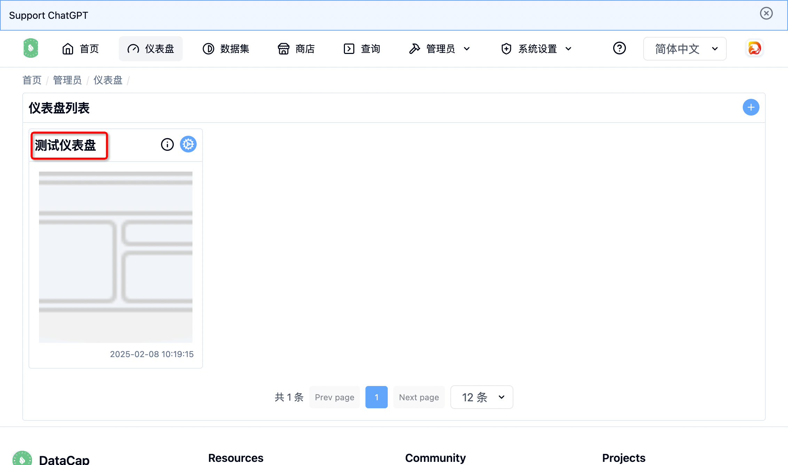

软件安装完成后点击顶部的 `仪表盘` 菜单，进入仪表盘页面。

### 添加仪表盘

---

点击页面左侧的 :circle-plus: 按钮弹出如下窗口

点击!btn[添加图表]{bg-white border}按钮，弹出数据报表窗口

选择需要添加的图表后点击 !btn[保存]{bg-blue-500 text-white} 按钮，出现类似如下页面

可以调整报表的位置大小等，然后点击右侧的 !btn[保存]{bg-blue-500 text-white} 按钮，弹出保存配置窗口

配置相关信息后，点击 !btn[保存]{bg-blue-500 text-white} 按钮，保存成功后将跳转到仪表盘预览页面。

这里会显示当前仪表盘的报表数据。

### 预览仪表盘

---

在仪表盘列表页面，点击仪表盘的名称，可跳转到当前选择的仪表盘。

!!! info "提示"

    该操作将会跳转到新页面进行仪表盘的显示。

!!!

### 编辑仪表盘

---

在仪表盘列表页面，点击 :cog: 图标，可出现操作列表

点击 !btn[修改仪表盘] 菜单，即可跳转到编辑仪表盘页面，该操作和新建仪表盘操作一致。

### 删除仪表盘

---

在仪表盘列表页面，点击 :cog: 图标，可出现操作列表

点击 !btn[删除仪表盘] 菜单，即可弹出如下窗口

在输入框中输入仪表盘名称，点击删除即可删除该仪表盘。