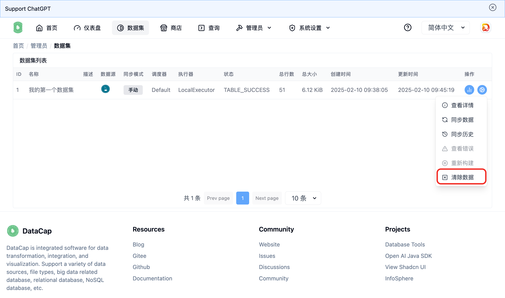
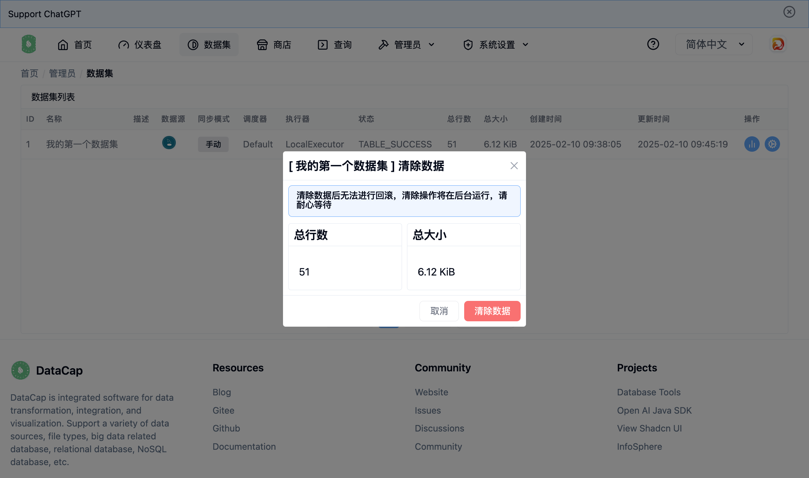

数据集提供了清空数据的操作，可以通过数据集列表中在每行数据的末尾有 `清空数据` 按钮，如下窗口

!!! info "提示"

    该操作只会在当前数据集有数据的情况下可以操作。

!!!

当数据集无数据的情况下，该菜单将不可操作。

点击 `清空数据` 按钮后会弹出 `清空数据` 窗口

该窗口中会展示当前数据集的 `总行数` 和 `总大小`

确定清空数据后，点击 `清空数据` 按钮后，系统会在后台创建清空数据任务，进行清空数据。