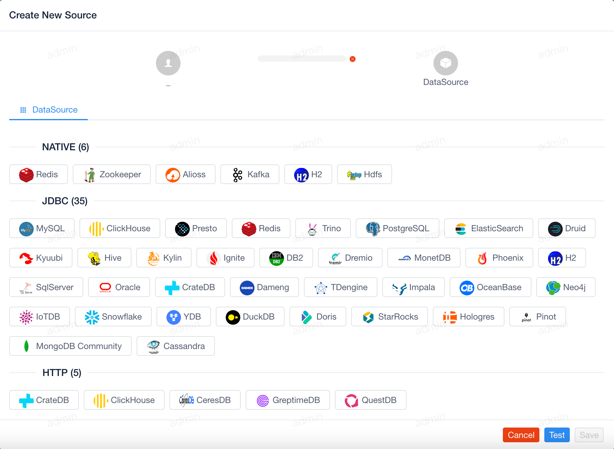
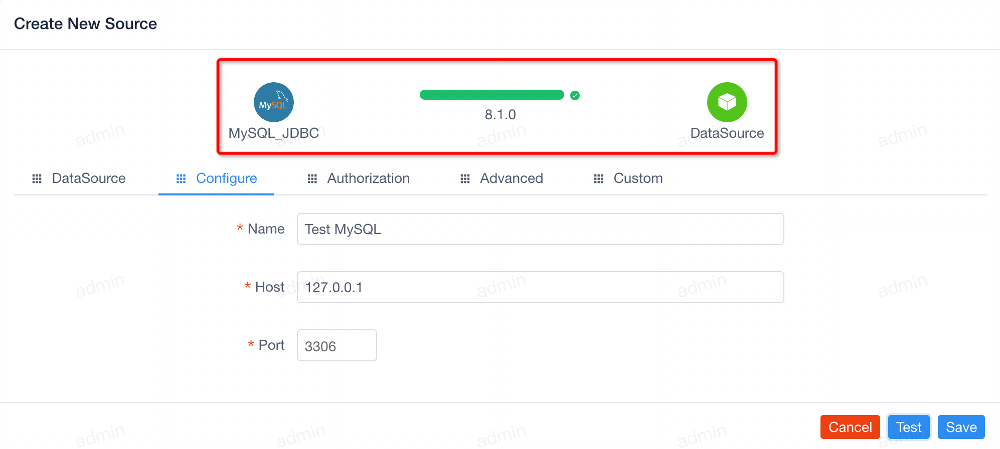
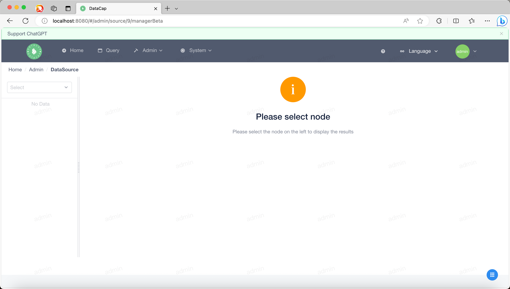

!!! info "提示"

    通过数据源功能，可以添加对各种自定义数据源的支持，并执行后续的数据源操作等。

!!!

鼠标移向顶部菜单的 `Admin` 标识下，会弹出下拉框，点击下拉框中的第一个子菜单。弹出类似如下窗口，默认列表为空，需要自行添加。

如果您添加了数据源会显示类似如下页面

### 添加数据源

---

点击列表展示区域的右侧添加按钮（它是一个 `+` 图标），点击后将弹出如下添加数据源窗口

当我们选择某种类型的数据源时，数据源配置信息将显示在顶部标签栏中，不同的数据源有不同的配置项，它的配置单在服务启动是的指定目录中。

当我们选择类型为 `MySQL` 的源时，弹出类似以下窗口

在配置页面中出现了4个选项卡，点击不同的选项卡填充相关信息，然后点击底部的 `Test` 按钮，会弹出如下页面：

当数据源测试成功后顶部会展示当前服务测试后的版本号，此时点击地步的 `Save` 按钮即可保存数据。

!!! info "提示"

    数据源保存后，数据源列表会自动刷新。

!!!

### 修改数据源

---

点击列表中某个数据源中 `Action` 中的第一个按钮即可修改数据源，操作类似于 `添加数据源` 操作

### 删除数据源

---

点击列表中某个数据源的 `Action` 中的第二个按钮，删除该数据源，点击后会弹出以下内容

单击弹出的小窗口，然后单击 `OK` 以删除选中的数据源。

!!! danger "注意"

    需要注意的是，删除数据源后，与数据源相关的查询历史记录将被删除。

!!!

### 数据源管理

---

单击列表中数据源的 `Action` 中的第三个或者第四个按钮，跳转到数据源管理页面。

页面分为左右两部分。左侧主要展示数据源的基本信息，包括：

- 选中数据源的相关元数据

#### 信息模块

当我们在左侧选择数据库和数据表时，右侧的内容显示如下

在右侧内容中出现两个选项卡:

- `Info`（默认选项）
- `Data`

!!! info "提示"

    默认当前选项卡下显示关于当前表的相关信息。

!!!

#### 数据模块

点击 `Data` 选项卡，会出现类似如下页面，它展示了当前选中表的相关数据。

在顶部的四个按钮分别是：

- `First Page`
- `Previous Page`
- `Next Page`
- `Last Page`

接下来后面的按钮是用于设置数据查询的配置：

- `Jump to Page`
- `Show Page Size`

填充配置后，点击 `Apply` 按钮即可应用当前配置信息。

在右侧还有一个按钮，点击后会展示当前查询使用到的详细 `SQL` 内容

!!! info "提示"

    当前 SQL 生成是根据同步到元数据的顺序而定。

!!!

!!! danger "注意"

    目前并不是所有的数据源都支持管理，如果需要可自行添加模版。如果有兴趣可将源码贡献给我们。

!!!