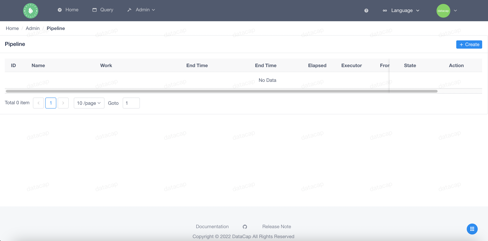
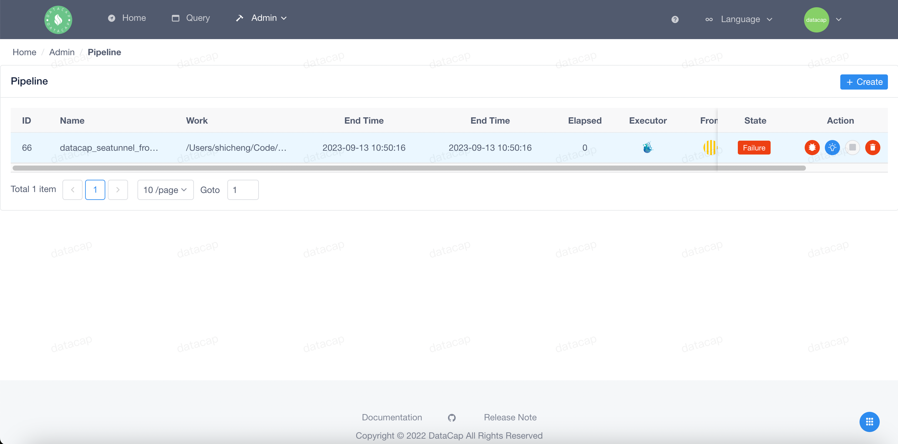

在 DataCap 软件中流水线用于用户针对数据进行迁移等一些数据操作的工具。

### 构建流水线

---

进入系统后，点击顶部 `Admin` 菜单下对应的 `Pipeline` 子菜单，默认进入流水线列表。类似下图：

点击列表右侧的 `+ Create` 按钮，系统会弹出配置页面：

配置页面分为三个配置模块，分别是：

- `Description` 主要配置用户执行的 SQL
- `From` 配置数据接入源
- `To` 配置数据输出源

每个数据源具有不同的配置属性，当选择数据源后按照提示配置相关属性即可。

当任务发布成功后默认会刷新任务列表，如下图所示：

### 流水线管理

---

任务发布后默认将会启动，在任务的右侧 `Action` 操作中包含以下功能：

#### 查看错误

当我们点击 `Action` 中的第一个按钮时，系统会弹出错误信息页面。

> 只有任务运行失败后该功能才会被启用

#### 查看日志

当我们点击 `Action` 中的第二个按钮时，系统会弹出日志页面。

#### 任务停止

当我们点击 `Action` 中的第三个按钮时，系统会弹出停止任务页面。

> 只有任务运行中该功能才会被启用

我们按照窗口提示的信息输入任务名字后点击 `Stop` 按钮即可。

#### 任务删除

当我们点击 `Action` 中的第四个按钮时，系统会弹出删除任务页面。

我们按照窗口提示的信息输入任务名字后点击 `Delete` 按钮即可。
